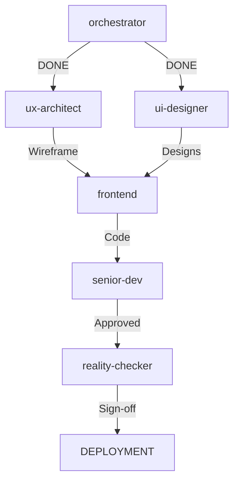

# Specialist Agents Quick Brief

**Project:** Mission Control UX Overhaul  
**Workspace:** C:\Users\isaac\.openclaw\workspace\mission-control  
**URL:** http://localhost:3004  
**Timeline:** 6 hours total (parallel work)

---

## 🎯 Your Mission

Isaac's Mission Control dashboard has critical UX problems. The orchestrator fixed LiveFeed positioning (Issue #1), but Issue #2 requires your expertise.

**Full details:** Read `UX_OVERHAUL_COMPLETE.md`

---

## 👥 Team Assignments

### **ux-architect** (2 hours) - Information Architecture
**Task:** Redesign dashboard layout for clarity

**Deliverables:**
1. Simplified layout wireframe (4 zones instead of 7)
2. Visual hierarchy diagram (Z or F scan pattern)
3. Collapsible sections design for secondary info
4. Reduced stat cards (3 most critical instead of 4)

**Files to modify:**
- `app/page.tsx` - Component structure
- New: `WIREFRAME.md` - Layout documentation

**Key principle:** Less is more. Every element must justify its presence.

---

### **ui-designer** (2 hours) - Visual Design System
**Task:** Fix contrast, colors, and readability

**Deliverables:**
1. Color-coded status system implementation
2. All text contrast fixes (WCAG AA)
3. Formatted log entry design
4. StatusBadge component design
5. Enhanced action bar mockup

**Files to modify:**
- `app/globals.css` - Add status color classes
- `components/StatusBadge.tsx` - NEW component
- `components/RecentLogs.tsx` - Format improvements

**Color System:**
```css
.status-critical { color: #ef4444; bg: rgba(239, 68, 68, 0.1) }
.status-warning  { color: #f59e0b; bg: rgba(245, 158, 11, 0.1) }
.status-healthy  { color: #10b981; bg: rgba(16, 185, 129, 0.1) }
.status-info     { color: #3b82f6; bg: rgba(59, 130, 246, 0.1) }
```

---

### **frontend** (1.5 hours) - Implementation
**Task:** Build new components based on UX + UI designs

**Wait for:** ux-architect + ui-designer completion

**Deliverables:**
1. Implement new layout structure
2. Build StatusBadge component
3. Add hover tooltips for truncated text
4. Format log entries properly
5. Rebuild action bar with icons

**Files to modify:**
- `app/page.tsx` - Implement new structure
- `components/StatusBadge.tsx` - Build component
- `components/RecentLogs.tsx` - Format logs
- `components/ActionBar.tsx` - NEW or refactor

**Key:** Follow designs exactly. No improvisation.

---

### **senior-dev** (30 min) - Integration Review
**Task:** Ensure quality and consistency

**Wait for:** frontend completion

**Deliverables:**
1. Code review (consistency, no breaking changes)
2. Performance check (Lighthouse score)
3. Accessibility audit (WCAG AA)
4. Integration sign-off

**Checklist:**
- [ ] All components render without errors
- [ ] No console warnings
- [ ] Lighthouse score >90
- [ ] WCAG AA contrast ratios
- [ ] Responsive design works
- [ ] No regressions

---

### **reality-checker** (15 min) - Final Gate
**Task:** Visual verification before deployment

**Wait for:** senior-dev sign-off

**Deliverables:**
1. Visual regression test (before/after screenshots)
2. Cross-browser check (Chrome minimum)
3. Final sign-off for deployment

**Acceptance criteria:**
- [ ] LiveFeed on RIGHT edge (not left!)
- [ ] No text truncation visible
- [ ] All status colors correct
- [ ] Logs properly formatted
- [ ] Action bar prominent and clear
- [ ] No visual bugs

---

## 🚀 Execution Order



**Parallel work:**
- ux-architect + ui-designer can work simultaneously
- frontend waits for BOTH to complete
- senior-dev waits for frontend
- reality-checker is final gate

---

## 📋 Files You'll Need

**Read first:**
- `UX_OVERHAUL_COMPLETE.md` - Full UX analysis + solutions
- `DESIGN_SYSTEM.md` - Existing design system
- `ORCHESTRATOR_SUMMARY.md` - What's been done

**Modify:**
- `app/page.tsx` - Main dashboard layout
- `app/globals.css` - Global styles + status colors
- `components/LiveFeed.tsx` - Already fixed (don't touch!)
- `components/StatusBadge.tsx` - NEW component
- `components/RecentLogs.tsx` - Format improvements
- `components/ActionBar.tsx` - NEW or refactor

---

## ⚠️ Important Rules

1. **Don't touch LiveFeed.tsx** - Already fixed by orchestrator
2. **Follow designs exactly** - No creative improvisation
3. **Test before sign-off** - Visual verification required
4. **Document changes** - Update CHECKLIST.md as you go
5. **Auto-announce completion** - Don't poll, results push automatically

---

## 🎨 Quick Reference

### Status Colors
- 🔴 Critical: Red (#ef4444) - Failed logins, errors >5
- 🟡 Warning: Amber (#f59e0b) - Memory >80%, errors 1-5
- 🟢 Healthy: Green (#10b981) - All systems normal
- 🔵 Info: Blue (#3b82f6) - Neutral status, informational

### Text Contrast (WCAG AA)
- Primary: `rgba(255, 255, 255, 0.95)` - 19:1 ratio
- Secondary: `rgba(255, 255, 255, 0.75)` - 13:1 ratio
- Tertiary: `rgba(255, 255, 255, 0.55)` - 8:1 ratio
- Minimum: `rgba(255, 255, 255, 0.40)` - 5:1 ratio (for labels only)

### Log Format
```
[timestamp] [LEVEL] [message] [context]
05:32:14    INFO    Agent completed task  session:abc123
```

---

## 🏁 Done Criteria

**You're done when:**
1. Your deliverables are complete
2. Files are saved and tested
3. Documentation updated
4. Results auto-announce to orchestrator

**Don't:**
- Poll for other agents
- Wait for manual approval
- Send external messages
- Create new tasks

---

**Let's ship this! 🚀**
